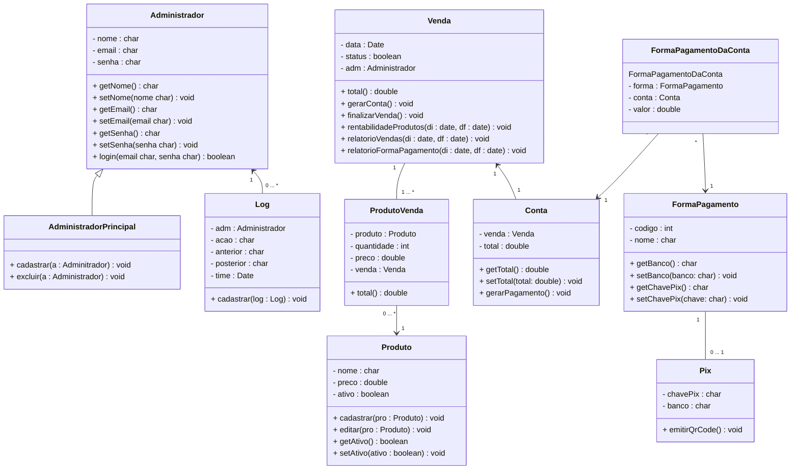
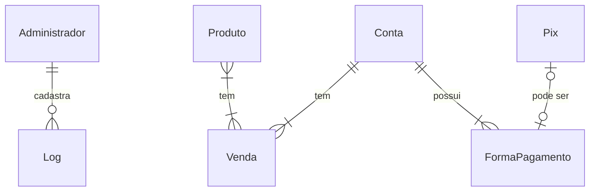

# Documento de Modelos

Neste documento temos o Modelo Conceitual (UML) e o Modelo de Dados (Entidade-Relacionamento). Temos também a descrição das entidades e o dicionário de dados.

Para a modelagem pode se usar o Astah UML ou o BrModelo. Uma ferramenta interessante para modelos UML é a [YUML](http://yuml.me), no link temos um exemplo de [Modelo UML com YUML](yuml/monitoria-yuml.md). Atualmente é possível usar a ferramenta **Mermaid** segundo o blog do GitHub [Include diagrams in your Markdown files with Mermaid](https://github.blog/2022-02-14-include-diagrams-markdown-files-mermaid/). A documentação do **Mermaid** pode ser encontrada em [Mermaid in GitHub](https://mermaid-js.github.io/mermaid).

## Modelo Conceitual

### Diagrama de Classes usando Mermaid

### Descrição das Entidades

Descrição sucinta das entidades presentes no sistema.

| Entidade | Descrição                                                                                                                                |
| -------- | ---------------------------------------------------------------------------------------------------------------------------------------- |
| Administrador   | Entidade que representa o Administrador tem as informações: nome, email, senha, + getNome(), + setNome(nome char), + getEmail(), + setEmail(email char), + getSenha(), + setSenha(senha char), + login(email, senha char).                                      |
| Administrador Principal     | Entidade que representa o Administrador Principal tem as informações: + cadastrar(a : Adminitrador), + excluir(a : Administrador). Esta classe é herdeira da classe Administrador. |
| Log     | Entidade que representa o Log tem as informações: adm, acao, anterior, posterior : char, time, + cadastrar(log : Log).             |
| Produto    | Entidade que representa um Produto tem as informações nome, preco, ativo, + cadastrar(pro : Produto), + editar(pro : Produto), + getAtivo(), setAtivo(ativo : boolean).                     |
| ProdutoVenda    | Entidade que representa um relacionamento N:N entre Produto e Venda.                    |
| Venda    | Entidade que representa uma Venda tem as informações data, status, adm : Administrador, + total(), + gerarConta(), + finalizarVenda(), + rentabilidadeProdutos(di : date, df : date), relatorioVendas(di : date, df : date), relatorioFormaPagamento(di : date, df : date).                     |
| Conta    | Entidade que representa uma Conta tem as informações venda : Venda, total, + getTotal(), + setTotal(total: double), + gerarPagamento().                     |
| FormaPagamento    | Entidade que representa uma FormaPagamento tem as informações codigo, nome, + getBanco(), + setBanco(banco: char), + getChavePix(), + setChavePix(chave: char).                |
| FormaPagamentoDaConta    | Entidade que representa um relacionamento N:N entre FormaPagamento e Conta.                |
| Pix    | Entidade que representa um Pix tem as informações chavePix, banco, + emitirQrCode().               |

## Modelo de Dados (Entidade-Relacionamento)

Para criar modelos ER é possível usar o BrModelo e gerar uma imagem. Contudo, atualmente é possível criar modelos ER usando a ferramenta **Mermaid**, escrevendo o modelo diretamente em markdown. Acesse a documentação para escrever modelos [ER Diagram Mermaid](https://mermaid-js.github.io/mermaid/#/entityRelationshipDiagram).

### Dicionário de Dados
* Administrador

| Tabela     | Administrador                                                                |
| ---------- | -------------------------------------------------------------------------- |
| Descrição  | Armazena as informações do administrador da loja.                       |
| Observação | O administrador pode ser o Administrador Principal com todas as permissões, mas também pode ser o administrador simplicado com permissões limitadas. |

| Nome          | Descrição                        | Tipo de Dado | Tamanho | Restrições de Domínio |
| ------------- | -------------------------------- | ------------ | ------- | --------------------- |
| codigo        | identificador gerado automatico  | INT          | ---     | PK / Identity         |
| nome          | nome do administrador            | VARCHAR      | 150     | Not Null              |
| e-mail        | e-mail de acesso do administrador| VARCHAR      | 150     | Not Null              |
| senha         | senha de acesso do administrador | VARCHAR      | 50      | Not Null              |

* Log
  
| Tabela     | Log                                                                |
| ---------- | -------------------------------------------------------------------------- |
| Descrição  | Armazena as informações de cada movimentação da loja.                       |
| Observação | O administrador pode realizar as ações que tenha permissão e para questão de segurança, salvará um log automaticamente de qual modificação foi feita e o autor |

| Nome          | Descrição                        | Tipo de Dado | Tamanho | Restrições de Domínio |
| ------------- | -------------------------------- | ------------ | ------- | --------------------- |
| codigo        | identificador gerado automatico  | INT          | ---     | PK / Identity         |
| adm           | identificador do administrador   | VARCHAR      | 150     | FK / Not Null         |
| acao          | ação realizada no sistema        | VARCHAR      | 150     | Not Null              |
| anterior      | senha de acesso do administrador | VARCHAR      | 150     | Not Null              |
| posterior     | senha de acesso do administrador | VARCHAR      | 150     | Not Null              |
| time          | senha de acesso do administrador | DATE         | ---     | Not Null              |

* Produto

| Tabela     | Produto                                                                |
| ---------- | -------------------------------------------------------------------------- |
| Descrição  | Armazena as informações de cada produto da loja.                       |
| Observação | O administrador pode cadastrar e editar um produto. |

| Nome          | Descrição                        | Tipo de Dado | Tamanho | Restrições de Domínio |
| ------------- | -------------------------------- | ------------ | ------- | --------------------- |
| codigo        | identificador gerado automatico  | INT          | ---     | PK / Identity         |
| nome          | nome do produto                  | VARCHAR      | 150     | Not Null              |
| preco         | valor que está custando o produto| DOUBLE       | ---     | Not Null              |
| ativo         | chave que configura a disponibilidade do produto | BOOLEAN    | ---   | Not Null  |

* Venda

| Tabela     | Venda                                                                |
| ---------- | -------------------------------------------------------------------------- |
| Descrição  | Armazena as informações de cada venda da loja.                       |
| Observação | O administrador pode cadastrar e cancelar uma venda. |

| Nome          | Descrição                        | Tipo de Dado | Tamanho | Restrições de Domínio |
| ------------- | -------------------------------- | ------------ | ------- | --------------------- |
| codigo        | identificador gerado automatico  | INT          | ---     | PK / Identity         |
| data          | data que a venda foi realizada   | DATE         | ---     | Not Null              |
| status        | status da venda (concluida ou cancelada) | BOOLEAN       | ---     | Not Null     |
| adm           | identificador do administrador   | INT      | ---     | FK / Not Null         |

* Conta

| Tabela     | Conta                                                                |
| ---------- | -------------------------------------------------------------------------- |
| Descrição  | Armazena as informações da conta da loja.                       |
| Observação | Será gerado uma conta para que receba um pagamento. |

| Nome          | Descrição                        | Tipo de Dado | Tamanho | Restrições de Domínio |
| ------------- | -------------------------------- | ------------ | ------- | --------------------- |
| codigo        | identificador gerado automatico  | INT          | ---     | PK / Identity         |
| venda         | identificador da venda realizada | INT          | ---     | FK / Not Null         |
| total         | valor total da venda             | DOUBLE       | ---     | Not Null              |

* FormaPagamento

| Tabela     | FormaPagamento                                                                |
| ---------- | -------------------------------------------------------------------------- |
| Descrição  | Armazena as informações da forma de pagamento da venda.                       |
| Observação | Será escolhida a forma que a conta será paga. |

| Nome          | Descrição                        | Tipo de Dado | Tamanho | Restrições de Domínio |
| ------------- | -------------------------------- | ------------ | ------- | --------------------- |
| codigo        | identificador gerado automatico  | INT          | ---     | PK / Identity         |
| nome          | tipo de pagamento (cartão, dinheiro, pix) | VARCHAR          | 150     | Not Null         |

* Pix

| Tabela     | Pix                                                                |
| ---------- | -------------------------------------------------------------------------- |
| Descrição  | Armazena as informações do pix da loja.                       |
| Observação | Será cadastrado as informações da chave pix. |

| Nome          | Descrição                        | Tipo de Dado | Tamanho | Restrições de Domínio |
| ------------- | -------------------------------- | ------------ | ------- | --------------------- |
| chavePix      | identificador da chave pix       | VARCHAR      | 150     | PK / Identity         |
| banco         | banco o qual o pix está vinculado| VARCHAR      | 150     | Not Null              |
