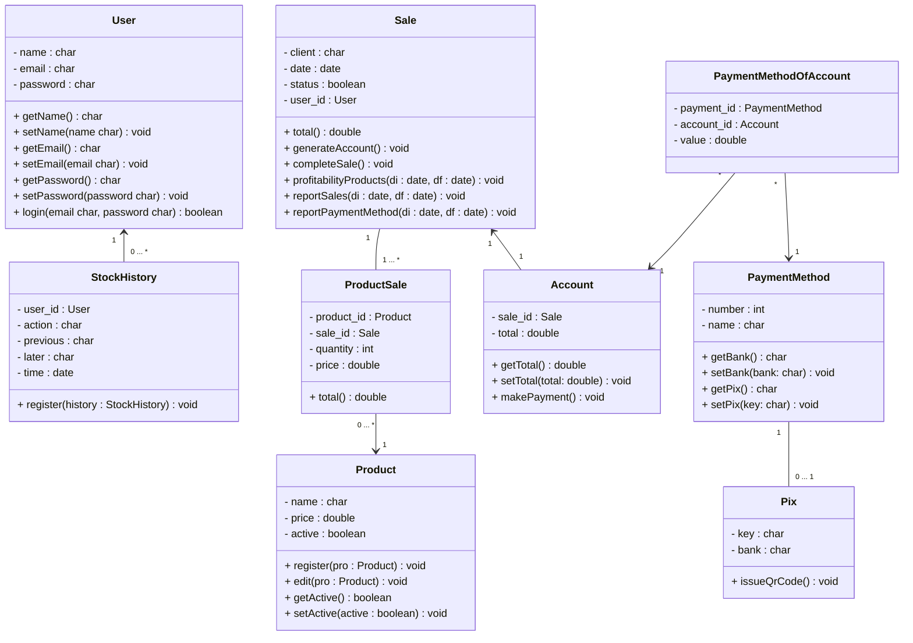
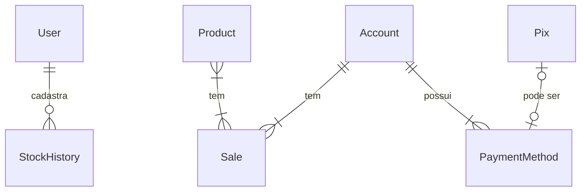

# Documento de Modelos

Neste documento temos o Modelo Conceitual (UML) e o Modelo de Dados (Entidade-Relacionamento). Temos também a descrição das entidades e o dicionário de dados.

Para a modelagem pode se usar o Astah UML ou o BrModelo. Uma ferramenta interessante para modelos UML é a [YUML](http://yuml.me), no link temos um exemplo de [Modelo UML com YUML](yuml/monitoria-yuml.md). Atualmente é possível usar a ferramenta **Mermaid** segundo o blog do GitHub [Include diagrams in your Markdown files with Mermaid](https://github.blog/2022-02-14-include-diagrams-markdown-files-mermaid/). A documentação do **Mermaid** pode ser encontrada em [Mermaid in GitHub](https://mermaid-js.github.io/mermaid).

## Modelo Conceitual

### Diagrama de Classes usando Mermaid

### Descrição das Entidades

Descrição sucinta das entidades presentes no sistema.

| Entidade | Descrição                                                                                                                                |
| -------- | ---------------------------------------------------------------------------------------------------------------------------------------- |
| User   | Entidade que representa o usuario tem as informações: name, email, password, + getName(), + setName(name char), + getEmail(), + setEmail(email char), + getPassword(), + setPassword(password char), + login(email, password char).                                      |
| StockHistory     | Entidade que representa o histórico de ações tem as informações: user_id, action, previous, later, + register(history : StockHistory).            |
| Product    | Entidade que representa um produto tem as informações name, price, active, + register(pro : Product), + edit(pro : Product), + getActive(), setActive(active : boolean).                     |
| ProductSale    | Entidade que representa um relacionamento N:N entre produto e venda.                    |
| Sale    | Entidade que representa uma venda tem as informações date, status, user_id : User, + total(), + generateAccount(), + completeSale(), + profitabilityProducts(di : date, df : date), reportSales(di : date, df : date), reportPaymentMethod(di : date, df : date).                     |
| Account    | Entidade que representa uma Conta tem as informações sale_id : Sale, total, + getTotal(), + setTotal(total: double), + makePayment().                     |
| PaymentMethod    | Entidade que representa uma forma de pagamento tem as informações number, name, + getBank(), + setBank(bank: char), + getPix(), + setPix(key: char).                |
| PaymentMethodOfAccount    | Entidade que representa um relacionamento N:N entre PaymentMethod e Account.                |
| Pix    | Entidade que representa um Pix tem as informações key, bank, + issueQrCode().               |

## Modelo de Dados (Entidade-Relacionamento)

Para criar modelos ER é possível usar o BrModelo e gerar uma imagem. Contudo, atualmente é possível criar modelos ER usando a ferramenta **Mermaid**, escrevendo o modelo diretamente em markdown. Acesse a documentação para escrever modelos [ER Diagram Mermaid](https://mermaid-js.github.io/mermaid/#/entityRelationshipDiagram).

### Dicionário de Dados
* User

| Tabela     | User                                                                       |
| ---------- | -------------------------------------------------------------------------- |
| Descrição  | Armazena as informações do User da loja.                                   |
| Observação | Ele poderá ser o admnistrador ou gerente.                                  |

| Nome          | Descrição                        | Tipo de Dado | Tamanho | Restrições de Domínio |
| ------------- | -------------------------------- | ------------ | ------- | --------------------- |
| id            | identificador gerado automatico  | INT          | ---     | PK / Identity         |
| name          | nome do usuario                  | VARCHAR      | 150     | Not Null              |
| e-mail        | e-mail de acesso do usuario      | VARCHAR      | 150     | Not Null              |
| password      | password de acesso do usuario    | VARCHAR      | 50      | Not Null              |

* StockHistory
  
| Tabela     | StockHistory                                                                |
| ---------- | --------------------------------------------------------------------------  |
| Descrição  | Armazena as informações de cada movimentação da loja.                       |
| Observação | O usuario logado pode realizar as ações que tenha permissão e para questão de segurança, salvará o historico de alterações automaticamente de qual modificação foi feita e o autor.                                                                                     |

| Nome          | Descrição                        | Tipo de Dado | Tamanho | Restrições de Domínio |
| ------------- | -------------------------------- | ------------ | ------- | --------------------- |
| id            | identificador gerado automatico  | INT          | ---     | PK / Identity         |
| user_id       | identificador do usuario         | VARCHAR      | 150     | FK / Not Null         |
| action        | ação realizada no sistema        | VARCHAR      | 150     | Not Null              |
| previous      | estado anterior da ação          | VARCHAR      | 150     | Not Null              |
| later         | estado posterior da ação         | VARCHAR      | 150     | Not Null              |
| time          | horário da alteração             | DATE         | ---     | Not Null              |

* Product

| Tabela     | Product                                                                    |
| ---------- | -------------------------------------------------------------------------- |
| Descrição  | Armazena as informações de cada produto da loja.                           |
| Observação | O Usuario pode register e editar um produto.                               |

| Nome          | Descrição                        | Tipo de Dado | Tamanho | Restrições de Domínio |
| ------------- | -------------------------------- | ------------ | ------- | --------------------- |
| id            | identificador gerado automatico  | INT          | ---     | PK / Identity         |
| name          | nome do produto                  | VARCHAR      | 150     | Not Null              |
| price         | valor que está custando o produto| DOUBLE       | ---     | Not Null              |
| active        | chave que configura a disponibilidade do produto | BOOLEAN    | ---   | Not Null  |

* Sale

| Tabela     | Sale                                                                       |
| ---------- | -------------------------------------------------------------------------- |
| Descrição  | Armazena as informações de cada venda da loja.                             |
| Observação | O usuario pode registrar e cancelar uma venda.                             |

| Nome          | Descrição                        | Tipo de Dado | Tamanho | Restrições de Domínio |
| ------------- | -------------------------------- | ------------ | ------- | --------------------- |
| id            | identificador gerado automatico  | INT          | ---     | PK / Identity         |
| cliente       | cliente da venda                 | VARCHAR      | ---     | Not Null              |
| date          | data que a venda foi realizada   | DATE         | ---     | Not Null              |
| status        | status da venda (concluida ou cancelada) | BOOLEAN        | ---     | Not Null    |
| user_id       | identificador do Usuario         | INT          | ---     | FK / Not Null         |

* Account

| Tabela     | Conta                                                                      |
| ---------- | -------------------------------------------------------------------------- |
| Descrição  | Armazena as informações da conta bancária da loja.                         |
| Observação | Será gerado uma conta para que receba um pagamento.                        |

| Nome          | Descrição                        | Tipo de Dado | Tamanho | Restrições de Domínio |
| ------------- | -------------------------------- | ------------ | ------- | --------------------- |
| id            | identificador gerado automatico  | INT          | ---     | PK / Identity         |
| sale_id       | identificador da venda realizada | INT          | ---     | FK / Not Null         |
| total         | valor total da venda             | DOUBLE       | ---     | Not Null              |

* PaymentMethod

| Tabela     | FormaPagamento                                                                |
| ---------- | --------------------------------------------------------------------------    |
| Descrição  | Armazena as informações da forma de pagamento da venda.                       |
| Observação | Será escolhida a forma que a conta será paga.                                 |

| Nome          | Descrição                        | Tipo de Dado | Tamanho | Restrições de Domínio |
| ------------- | -------------------------------- | ------------ | ------- | --------------------- |
| id            | identificador gerado automatico  | INT          | ---     | PK / Identity         |
| name          | tipo de pagamento (cartão, dinheiro, pix) | VARCHAR          | 150     | Not Null |

* Pix

| Tabela     | Pix                                                                        |
| ---------- | -------------------------------------------------------------------------- |
| Descrição  | Armazena as informações do pix da loja.                                    |
| Observação | Será cadastrado as informações da chave pix.                               |

| Nome          | Descrição                        | Tipo de Dado | Tamanho | Restrições de Domínio |
| ------------- | -------------------------------- | ------------ | ------- | --------------------- |
| key           | identificador da chave pix       | VARCHAR      | 150     | PK / Identity         |
| bank          | banco o qual o pix está vinculado| VARCHAR      | 150     | Not Null              |
