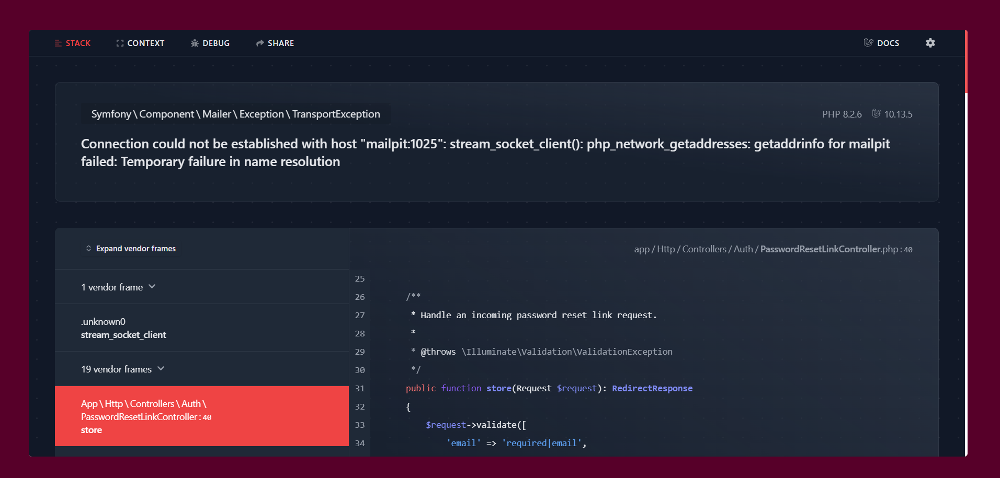

**Relatório de Testes de Módulo/Sistema**

Responsabilidade do Testador

**Legenda**

**Teste** : User Story US00 - Manter Usuário.

**Descrição**: Criação, listagem, edição e exclusão de dados de um usuário, quando requisitado pelo administrador

**Especificação**:Após o usuário entrar no sistema na barra lateral tem o icone de usuarios, onde ao clicar ele verá a listagem de usuários cadastrado, podendo editas, excluir e adicionar os outros usuários.

**Resultado**: O que foi executado está de acordo com o userstory.

**US00 - Manter Usuário**

| **Teste** | **Descrição** | **Especificação** | **Resultado** |
| :--------- | :--------------- | :-------------- | :--------------- |
| Teste 01: Listar | A1 -Listar   A1.1 O administrador clica no icone de usuários na para lateral dos sistema   A1.2 Após clicar aprece a página principal do usuário, listando todos eles, tendo as informações de Nome, Email, o tipo de perfil e as açõs (editar e deletar), além do botão no  canto superior de adicionar um novo usuário e um campo de busca. A1.3. Fim do fluxo.| A implementação está de acordo com a especificação do User Story. | O listar está funcionando.  |
| Teste 02: Cadastrar | A2 -Cadastro   A2.1 Clico no botão cadatrar no canto superior.   A2.2 Usuário é direcionando a páogina de cadastro.   A2.3 Preenche todos os dados requisitados pelo sistema, nome, email, senha e confirmação.   A2.4 Se algum item estiver incorreto, seja o formato do email (ou se esse email ja está cadastrado), ou se colocou a senha no tamanho correto, ele informa para o usuário digitar novamente.   A2.5 Colocando os dados corretamente ele será direcionando para a página de detalhes do usuário, onde, tem a opção de deletar ou editar as informações. A2.6 Fim do fluxo.| A implementação está de acordo com a especificação do User Story. | O criar está funcioanndo corretamente |
| Teste 03: Excluir | A3 - Exclusão   A3.1 Quando está na página de listar ousuário, ou no de detalhe, é possíivel ver o botão com icone de lixeira, que é o que vamos clicar para excluir o usuário   A3.2 Só é possóvel excluir se o ator foi um administrador   A3.3 Escolhedo o usuário e clicando no botão de lixeira, aparece uma notificão de confirmação, para ter certeza que vai excluir   A3.4 Clicando no botão de confirmar, o funcionário some da listagem.   A3.5 Caso saia do sistema antes de finalizar a excllusão, ela não é realizada.   A3.6 Fim do fluxo|A implementação está de acordo com a especificação do User Story. | O Excluir está funcionando corretamente |
| Teste 04: Editar | A4 -  Editar   A4.1 A edição pode se achar em dois lugares, seja no perfil, ou na listagem de usuários  A4.2 Clica no botão com o icone de lápis   A4.3 Usuario é direcionando para a página de edição  A4.5 É possível editar nome e email, ou adicionar uma nova senha   A4.6 Após clicar no botão de confirmar, vai para a página de detalhes com a notificação temporária avisando que as alterações foram realizada com sucesso   A4.7 fim do fluxo| A implementação está de acordo com a especificação do User Story. | O Eeditar está funcionando corretamente.  |

**Teste** : User Story US01 - Login.

**Descrição**:O usuário deverá preencher os campos com as informações
requisitadas, o email e a senha para poder, assim, ter acesso ao
sistema.

**Especificação**:O sistema terá uma tela de login para o usuário entrar
e realizar operações. O login será feito com email e senha. E terá a
possibilidade de recuperar a senha.

**Resultado**: Com as informações corretas o login funciona
corretamente, levando o usuário para a página principal, no entanto o
erro se dá quando o usuário tenta recuperar a senha, pois a configuração
do servidor de email ainda não está implementada, gerando essa exception

**US001 - Login**

| **Teste** | **Descrição** | **Especificação** | **Resultado** |
| :--------- | :--------------- | :-------------- | :--------------- |
| Teste 01: login | A1 -Login   A1.1. O ator preenche os dados;   A1.2. O ator seleciona o botão log in;   A1.3. O sistema valida os dados;    A1.4. O ator entra na página principal do sistema; A1.5. Se as informações postas estiverem incorretas, o sistema envia uma mensagem de erro e permite o usuário preencher os dados novamente; A1.6.Caso o usuário esqueça a senha e clique no botão de esqueceu a senha? o usuário é direcionado a página para enviar o email, porém apresenta erro ao enviar o email A1.7. Fim do fluxo. | A função implementada não segue os passos A1.6. A implementação não está de acordo com a especificação do User Story. | O login funcionou, porém não funciona a implementação do esqueceu a senha.  |

**Teste** : User Story US02 - Logout.

**Descrição**:O usuário deverá clicar no botão de logout para sair do sistema e ser direcionado a página de login.

**Especificação**:O usúario clica no botão em questão, de sair do sistema, e é direcionado a página de login, lembrando que se fechar a aba sem fazer o logout do sistema, sua conta ainda estará ativa.

**Resultado**: Segindo os passos, tudo funciona corretamente, e está de acordo com o que foi descrito no userstory.

**US002 - Logout**

| **Teste** | **Descrição** | **Especificação** | **Resultado** |
| :--------- | :--------------- | :-------------- | :--------------- |
| Teste 01: logout | A1 -Logout   A1.1 Usuário entra no sistema.   A1.2 Cliquei no botão superior direito, que possui o nome do usuário   A1.3 Após clicar aprece dois botões, um para ir para o perfil e outro para sair   A1.4 clico no botão de sair   A1.5 Usuário é direcionado a página de login   A1.6 Caso o usuário saia antes de deslogar, o login do ator ficará ativo. A1.7 Fim do fluxo.| A implementação está de acordo com a especificação do User Story. | O logout funcionou.  |

**Teste** : User Story US03 - Manter Produtos.

**Descrição**: Criação, listagem, edição e exclusão de dados de um Produto, quando requisitado pelo administrador

**Especificação**:Após o usuário entrar no sistema na barra lateral tem o icone de produtos, onde ao clicar ele verá a listagem de produtos cadastrado, podendo editas, excluir e adicionar os outros produtos.

**Resultado**: O que foi executado está de acordo com o userstory.

**US03 - Manter Produto**

| **Teste** | **Descrição** | **Especificação** | **Resultado** |
| :--------- | :--------------- | :-------------- | :--------------- |
| Teste 01: Listar | A1 -Listar   A1.1 O administrador clica no icone de produtos na para lateral dos sistema   A1.2 Após clicar aprece a página principal do produto, listando todos eles, tendo as informações de Nome, preço e as açõs (editar e deletar), além do botão no  canto superior de adicionar um novo produto e um campo de busca. A1.3. Fim do fluxo.| A implementação está de acordo com a especificação do User Story. | O listar está funcionando.  |
| Teste 02: Cadastrar | A2 -Cadastro   A2.1 Clico no botão cadatrar no canto superior.   A2.2 Usuário é direcionando a página de cadastro.   A2.3 Preenche todos os dados requisitados pelo sistema, nome e preço.   A2.4 Se algum item estiver incorreto, como o preço, que tem que ser número, ele informa, caso o usuário tente por letras.   A2.5 Colocando os dados corretamente ele será direcionando para a página de detalhes do produto, onde, tem a opção de deletar ou editar as informações. A2.6 Fim do fluxo.| A implementação está de acordo com a especificação do User Story. | O criar está funcioanndo corretamente |
| Teste 03: Excluir | A3 - Exclusão   A3.1 Quando está na página de listar produto, ou no de detalhe, é possível ver o botão com icone de lixeira, que é o que vamos clicar para excluir o produto   A3.2 Só é possóvel excluir se o ator foi um administrador   A3.3 Escolhedo o produto e clicando no botão de lixeira, aparece uma notificão de confirmação, para ter certeza que vai excluir   A3.4 Clicando no botão de confirmar, o produto some da listagem.   A3.5 Caso saia do sistema antes de finalizar a exclusão, ela não é realizada.   A3.6 Fim do fluxo|A implementação está de acordo com a especificação do User Story. | O Excluir está funcionando corretamente |
| Teste 04: Editar | A4 -  Editar   A4.1 A edição é feita na página de listagem  A4.2 Clica no botão com o icone de lápis   A4.3 Usuario é direcionando para a página de edição  A4.5 É possível editar o nome e o preço   A4.6 Após clicar no botão de confirmar, vai para a página de detalhes com a notificação temporária avisando que as alterações foram realizada com sucesso   A4.7 fim do fluxo| A implementação está de acordo com a especificação do User Story. | O Editar está funcionando corretamente.  |

**Teste** : User Story US03 - Manter Pix.

**Descrição**: Criação, listagem, edição e exclusão de dados de um Pix, quando requisitado pelo administrador

**Especificação**:Após o usuário entrar no sistema na barra lateral tem o icone de pixs, onde ao clicar ele verá a listagem de pixs cadastrado, podendo editar, excluir e adicionar os outros pixs.

**Resultado**: As funcionalidades estão de acordo ao userStory.

**US03 - Manter Pix**

| **Teste** | **Descrição** | **Especificação** | **Resultado** |
| :--------- | :--------------- | :-------------- | :--------------- |
| Teste 01: Listar | A1 -Listar   A1.1 O administrador clica no icone de pixs na para lateral dos sistema   A1.2 Após clicar aprece a página principal do pix, listando todos eles, tendo as informações de Nome, cahve e tipo e as açõs (editar e deletar), além do botão no  canto superior de adicionar um novo pix e um campo de busca. A1.3. Fim do fluxo.| A implementação está de acordo com a especificação do User Story. | O listar está funcionando.  |
| Teste 02: Cadastrar | A2 -Cadastro   A2.1 Clico no botão cadatrar no canto superior.   A2.2 Usuário é direcionando a página de cadastro.   A2.3 Preenche todos os dados requisitados pelo sistema, nome, chave e tipo   A2.4 Se algum item estiver incorreto, ele avisa e deixa o usuário digitar novamente.   A2.5 Colocando os dados ele será direcionando para a página de detalhes do pix, onde, tem a opção de deletar ou editar as informações. A2.6 Fim do fluxo.| A função implementada não segue os passos A2.4. A implementação não está de acordo com a especificação do User Story. | Funcionando perfeitamente |
| Teste 03: Excluir | A3 - Exclusão   A3.1 Quando está na página de listar pix, ou no de detalhe, é possível ver o botão com icone de lixeira, que é o que vamos clicar para excluir o pix   A3.2 Só é possóvel excluir se o ator foi um administrador   A3.3 Escolhedo o pix e clicando no botão de lixeira, aparece uma notificão de confirmação, para ter certeza que vai excluir   A3.4 Clicando no botão de confirmar, o pix some da listagem.   A3.5 Caso saia do sistema antes de finalizar a exclusão, ela não é realizada.   A3.6 Fim do fluxo|A implementação está de acordo com a especificação do User Story. | O Excluir está funcionando corretamente |
| Teste 04: Editar | A4 -  Editar   A4.1 A edição é feita na página de listagem  A4.2 Clica no botão com o icone de lápis   A4.3 Usuario é direcionando para a página de edição  A4.5 É possível editar o nome e o preço   A4.6 Após clicar no botão de confirmar, vai para a página de detalhes com a notificação temporária avisando que as alterações foram realizada com sucesso   A4.7 fim do fluxo| A implementação está de acordo com a especificação do User Story. | O Eeditar está funcionando corretamente.  |

**Relatório de Bugs e Providências**

Responsabilidade do Gerente

 | **Teste**       |        **Providência**     |    **Tarefas/Tipo**|
 | :--------- | :--------------- | :--------------
  | Teste 02 - Login |    Configurar servidor de email. |  Tarefa: Providenciar de Implementação.
